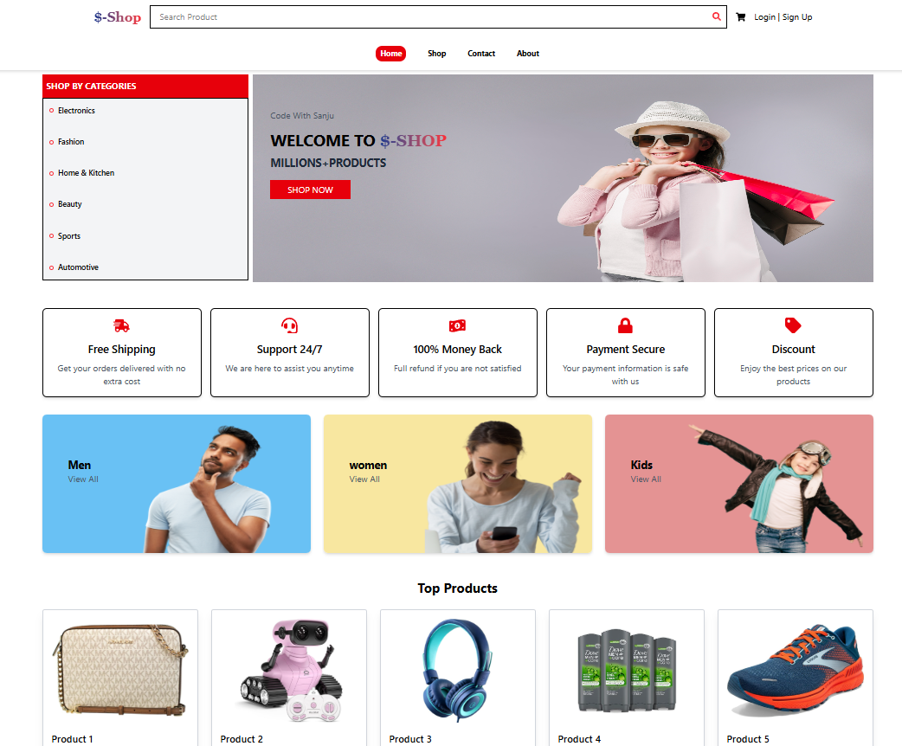
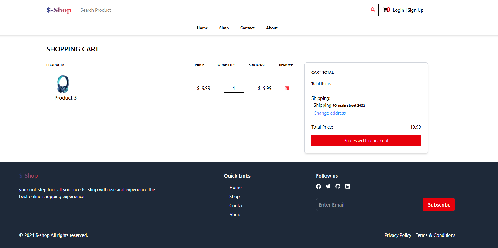
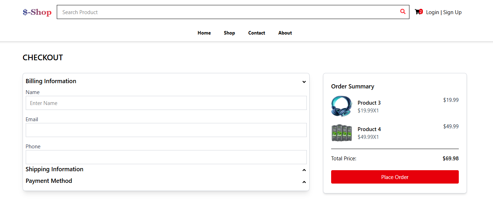
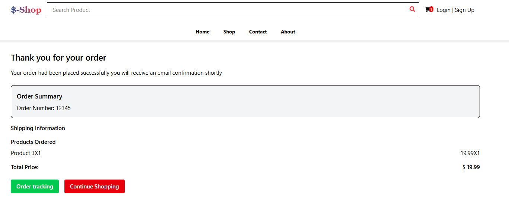

# 🛍️ $-Shop – E-commerce Web Application

**$-Shop** is a modern, responsive, and user-friendly **e-commerce web app** built with **React, Redux Toolkit, Tailwind CSS, and React Router**.  
It allows users to explore products, view details, manage their cart, update shipping information, and place orders with ease.  

⭐ *“$-Shop – Your smart companion for hassle-free shopping.”*

---

## ✨ Features

### 🏠 Home & Categories
- Hero section with promotional banner.
- **Category Section** for Men, Women, and Kids (with hover animations).
- Featured products and top picks displayed dynamically.

### 🛍️ Product Experience
- **Product Listing (Shop Page):** Grid-based product catalog.
- **Product Details Page:** Image, price, quantity selector, and add-to-cart functionality.

### 🛒 Cart & Checkout
- Add, remove, or update product quantities.
- Dynamic subtotal and total price calculations.
- Option to **change shipping address** using a modal form.
- Checkout page with order summary.

### ✅ Order Confirmation
- Displays **order number, products purchased, shipping details, and total price**.
- Options to track the order or continue shopping.

### 📱 Responsive Design
- Fully responsive for desktop, tablet, and mobile devices.
- Smooth animations and hover effects.

---

## 🛠️ Tech Stack

- **Frontend:** React (Vite setup)  
- **State Management:** Redux Toolkit  
- **Routing:** React Router DOM  
- **Styling:** Tailwind CSS  
- **Notifications:** React Hot Toast  
- **Icons:** React Icons  

## 📂 Project Structure
$-shop/
- ├── public/                # Static files
- ├── src/
- │   ├── components/        # Reusable UI components (Navbar, Footer, Modal, Checkout, etc.)
- │   ├── pages/             # Pages (Home, Shop, Cart, Order, ProductDetail)
- │   ├── redux/             # Redux store & slices
- │   │   ├── store.js
- │   │   ├── cartSlice.js
- │   │   ├── productSlice.js
- │   ├── assets/            # Images, mock data
- │   ├── App.jsx            # Main app with routes
- │   ├── main.jsx           # Entry point (ReactDOM + Provider)
- │   └── index.css          # Global styles (Tailwind)
- └── package.json

---

## 📸 Screenshots

### 🏠 Home Page

### 🛒 Cart Page

### 💳 Checkout

### ✅ Order Confirmation

---

## 🚧 Future Enhancements (Roadmap)

- 🔑 User authentication (Login / Signup)  
- 💳 Payment integration (Stripe / Razorpay)  
- ❤️ Wishlist & Favorites  
- 🔍 Advanced filtering & sorting (price, rating, category)  
- 📦 Order history & tracking system  

---

## 🤝 Contributing

Contributions are welcome! 🎉  

Steps:  
1. **Fork** the repo  
2. **Create a branch** (`git checkout -b feature-branch`)  
3. **Commit changes** (`git commit -m "Add new feature"`)  
4. **Push** (`git push origin feature-branch`)  
5. **Open a Pull Request** 🚀  

---

## 📄 License

This project is licensed under the **MIT License** – free to use, modify, and distribute.

---

## 👨‍💻 Author

Developed by **Sanju Kumar Sahu** ✨  
If you like this project, please ⭐ the repository!
